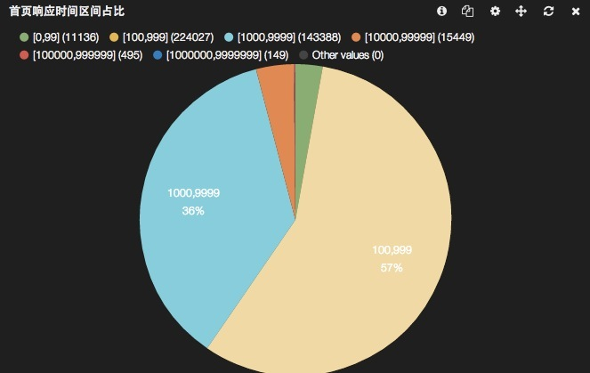
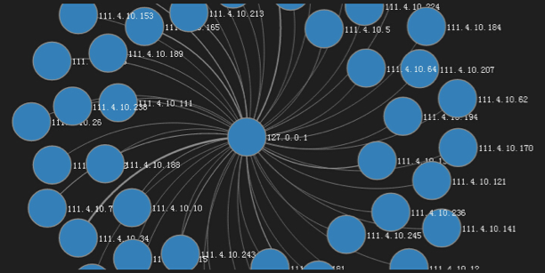

chenryn's changelog
================

## Auth WebUI in Mojolicious

There is alreadys kibana-auth repos wrote in NodeJs or RubyOnRails. However I don't familar with both those but can only write a little Perl5 code. So, I use [Mojolicious](http://mojolicio.us) web framework to do this.

I place all my auth code at `kbnauth` sub directory, if you don't want any auth, just use the original `src` directory.(In facts, I use symlinks for my `kbnauth/public/*`)

### features

* full proxy

You can control every requests sending to elasticsearch. I use `config.js.ep` for `elasticsearch` setting, and return a **fake** `/_nodes` response body which only has one node point to the webserver.

*Note: Mojolicious set default `max_message_size` to 10MB, I change this setting to 0 which means indefinite size in `script/kbnauth`. You can change this to any threshold value you want.*

* using a elasticsearch `kibana-auth` index for authorization

Since all the requests would send to the proxy server, every user would has his own namespace for dashboards(`kibana-int-$username`, yes, it's a common implement that kibana-proxy used. You can run `./script/kbnauth migratint username hisdashname...` for quick migration) and can only access his own indices or even cluster.

You can add `kibana-auth` for user "sri" as follow:

```
$ curl -XPOST http://127.0.0.1:9200/kibana-auth/indices/sri -d '{
  "prefix":["logstash-sri","logstash-ops"],
  "route" :"/dashboard/elasticsearch/sri-dash",
  "server":"192.168.0.2:9200"
}'
```

Or (for windows user, you can use Strawberry Perl to do this directly)

```perl
perl -MHTTP::Tiny -MJSON -E 'say to_json(HTTP::Tiny->new->post("http://10.13.57.35:9200/kibana-auth/indices/sri", {content=>to_json({prefix=>["logstash-sri","logstash-ops"],route=>"/dashboard/elasticsearch/sri-dash",server=>"192.168.0.2:9200"})}))'
```

Then "sri" can access the "logstash-sri-YYYY.mm.dd" and "logstash-ops-YYYY.mm.dd" indices stored on "192.168.0.2:9200". And he would see `/dashboard/elasticsearch/sri-dash` dashboard as homepage.

* using [Authen::Simple](https://metacpan.org/pod/Authen::Simple) framework for authentication

Authen::Simple is a great framework that support so many authentication methods. For example: LDAP, DBI, SSH, Kerberos, PAM, SMB, NIS, PAM, ActiveDirectory etc.

I use Passwd as default(using `htpasswd` commandline). But you can add/change more methods to `kbn_auth.conf` as follow:

```perl
  authen => {
    LDAP => {
      host   => 'ad.company.com',
      binddn => 'proxyuser@company.com',
      bindpw => 'secret',
      basedn => 'cn=users,dc=company,dc=com',
      filter => '(&(objectClass=organizationalPerson)(objectClass=user)(sAMAccountName=%s))'
    },
  }
```

### Install

The code depands on Mojolicious and Authen::Simple.

```
curl http://xrl.us/cpanm -o /usr/local/bin/cpanm
chmod +x /usr/local/bin/cpanm
cpanm Mojolicious Authen::Simple::Passwd
```

*For windows user, install [Strawpberry Perl](http://strawberryperl.com/) which bring `cpanm` already.*

If you want use other authen methods, for example, LDAP, just run `cpanm Authen::Simple::LDAP`.

*Tips: if you run the code at a clean RHEL system, you may find `Digest::SHA` need to install too. RedHat split Perl core modules to a special `perl-core` RPM. Run `yum install -y perl-core` to solve it. I HATE REDHAT!*

### Run

```
cd kbnauth
morbo script/kbnauth # listen :3000 for development
hypnotoad script/kbnauth     # listen :80 for production, ports defined at kbn_auth.conf
```

Now you can login with init user/pass: "sri/secr3t". (this is the name of mojolicious creator)

## percentile panel

Percentile is a great data analysis method. Elasticsearch add percentile aggregation support after version 1.1.0. But Kibana v3 use an outdate elastic.js which don't support aggergation! So I write this panel using native angularjs `$.http` api.

*Elasticsearch had add percentile rank in version 1.3.0, so exciting!*

*Tips: merged new version of elasticjs at 2014/08/15, should rewrite this panel now.*(DONE at 2014/08/16)

## range panel

I need a pie chart to show percentile of range sections(percentile rank wait for only one value). So I use RangeFacet to implement this.

Here is the rendering:



And you can add more range sections as you like:


## bettermap providers

Now you can select different leaflet map providers from `bettermap` panel settings.

For chinese user, there is **GaoDe**(高德地图)!


## queries generator

Fetch `_type` and `fields` from `/_mapping` API. and help you to generate some querystrings by click multi-select.


## histogram threshold notification

Use [HTML5 Notification API](https://developer.mozilla.org/en-US/docs/Web/API/notification) to alert the outier value of queries.


## china map

Use map.cn.js from <http://jvectormap.com/maps/countries/china/>, delete `CN-` because `filter/geoip` don't have such prefix.

Add Taiwan to this map.

Many thanks to this author(@loveshell)!

## term_stats map

Provide a way to choose the stat to display into the map, not only the total number of hits but also min/max/total etc.

Many thanks to this author(@eMerzh)!

<https://github.com/elasticsearch/kibana/pull/1270>

## statisticstrend panel

This panel is so useful if you want to check the trend of your statistic history.


Many thanks to this author(@opsSysDev)!

## multifieldhistogram panel

Enable histogram panel to plot multiple fields.


Many thanks to this author(@tvvmb)!

<https://github.com/elasticsearch/kibana/pull/1296>

## valuehistogram panel

Enhances the histogram panel to support value-based histograms in addition to time-series histograms.


Many thanks to this author(@jdve)!

<https://github.com/elasticsearch/kibana/pull/622>

## panel refresh

Adds refresh icon to kibana panel directive which broadcasts a refresh event down its scope chain.

Many thanks to this author(@thegreenpizza)!

<https://github.com/elasticsearch/kibana/pull/1423>

## Upgraded angular, elasticsearchjs and elasticjs

* Angular is now at 1.2.20
* Elasticsearch JS now included
* Updated to the latest elasticjs

<https://github.com/elasticsearch/kibana/pull/1377>

*If you had wrote your own panels and want to migrate to the latest elasticjs, just change a few codes as follow:*

```javascript
request = $scope.ejs.Request();
results = $scope.ejs.doSearch(dashboard.indices, request);
$scope.inspector = request.toJSON();
```

## force panel

Add force panel of packetbeat.



<https://github.com/packetbeat/kibana/commit/27cba54a73dd4246161df1bb1ed45d380588c6a5>

TODO
=======================

* <del>Math.log() for valuehistogram panel</del> (had try `_.map(series, function(v){return Math.log(v)})`, not so useful)
* percentile histogram panel <http://www.flotcharts.org/flot/examples/percentiles/index.html>??
* heatmap panel <http://www.patrick-wied.at/static/heatmapjs/plugin-leaflet-layer.html>
* <del>threshold for histogram <http://www.flotcharts.org/flot/examples/threshold/index.html></del> (had try, not so useful, but I keep this commit in the repo)
* <del>webkit.notification for histogram</del>
