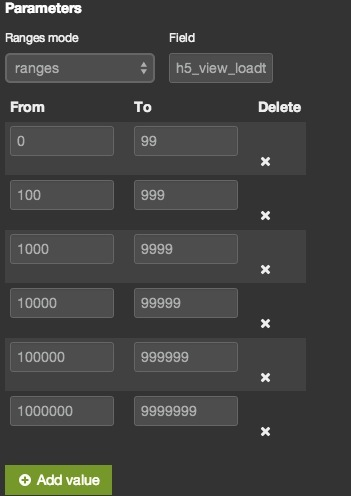

changelog
================

## percentile panel

Percentile is a great data analysis method. Elasticsearch add percentile aggregation support after version 1.1.0. ~~But Kibana v3 use an outdate elastic.js which don't support aggergation! So I write this panel using native angularjs `$.http` api.~~ Merged new version of elasticjs at 2014/08/15, rewrite this panel now.(DONE at 2014/08/16)

Add compression options to control PercentileAggregation, because percentile may be so slow. Saw <http://www.elasticsearch.org/guide/en/elasticsearch/reference/current/search-aggregations-metrics-percentile-aggregation.html#search-aggregations-metrics-percentile-aggregation-compression> for the reason.

## range panel

I need a pie chart to show percentile of range sections(percentile rank wait for only one value). So I use Range to implement this.

Here is the rendering:


And you can add more range sections as you like:



## export table panel as CSV

Port kibana 4 exportAsCsv function back to kibana 3.

Note that I add the export icon in panelModal, so you may need add a `"exportable":true` into your exists dashboard json by hands, overwise it won't trigger the `ng-show`.

## uniq mode for histogram panel

First, I re-implement histogram panel using the new aggregations api instead of v1 api. The requst now is a nested aggregation with global/filter/date_histogram in turns. Then we can set stats aggregation as a sub aggr for "min/max/avg", and also cardinality aggregation for "uniq"! What ever you want could be added in the same way. Much thanks for aggr.

**Attention: the cardinality aggregation was added in elasticsearch 1.1.0.**

Offical blog about cardinality aggr: <http://www.elasticsearch.org/blog/count-elasticsearch/>

## bettermap providers

Now you can select different leaflet map providers from `bettermap` panel settings.

For chinese user, there is **GaoDe**(高德地图)!


## panel refresh

Adds refresh icon to kibana panel directive which broadcasts a refresh event down its scope chain.

Many thanks to this author(@thegreenpizza)!

<https://github.com/elasticsearch/kibana/pull/1423>

## Upgraded angular, elasticsearchjs and elasticjs

* Angular is now at 1.2.20
* Elasticsearch JS now included
* Updated to the latest elasticjs(use a new fork: <https://github.com/ErwanPigneul/elastic.js> 2015.11.04)

<https://github.com/elasticsearch/kibana/pull/1377>

Add two configuration settings into `config.js`:

1. sniff: now kibana would sniff all your nodes by default
2. request_timeout: now kibana wouldn't render panels if your data return after 30 seconds

*If you had wrote your own panels and want to migrate to the latest elasticjs, just change a few codes as follow:*

```javascript
request = $scope.ejs.Request();
results = $scope.ejs.doSearch(dashboard.indices, request);
$scope.inspector = request.toJSON();
```

## hiddenable navbar

Add `ng-show="dashboard.current.nav.length"` into `index.html`. So now you can use dynamic script dashboard to show only panel without any other things. This is very useful if you want embed some panel chart into other systems.

See script dashboard at : <./src/app/dashboards/panel.js>

